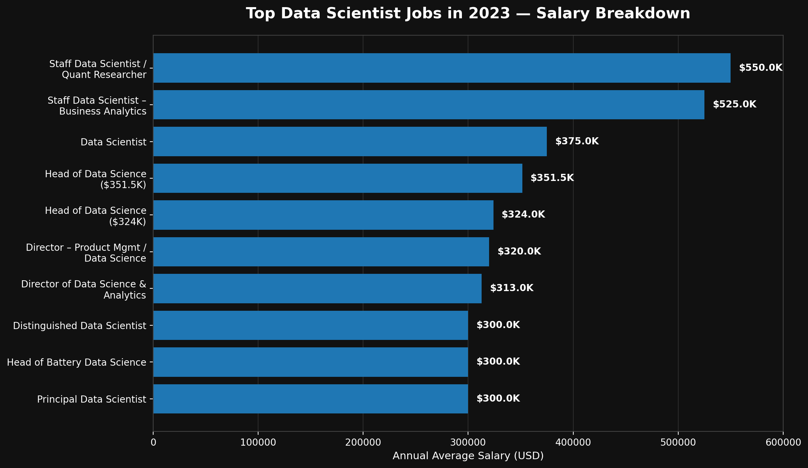

# Introduction
📊 Dive into the data science job market! Focusing on data scientist roles, this project explores 💰 top-paying jobs, 🔥 in-demand skills, and 📈 where high demand meets high salary in data science.

🔍 SQL queries? Check them out here: [project_sql folder](/project_sql/).

# Background
Designed to demystify the competitive data science job market, this project identifies the most lucrative and highly sought-after skills. By doing so, it simplifies the search process, helping fellow data scientists find their ideal roles faster.

The analysis is powered by data from [SQL Course](https://www.lukebarousse.com/sql), featuring comprehensive breakdowns of job titles, salary expectations, geographic trends, and essential technical competencies.

### The questions I wanted to answer through my SQL queries were:

1. What are the top-paying data scientist jobs?
2. What skills are required for these top-paying jobs?
3. What skills are most in demand for data scientists?
4. Which skills are associated with higher salaries?
5. What are the most optimal skills to learn?

# Tools I Used
To conduct a comprehensive analysis of the data scientist job market, I utilized the following tools:  

- **SQL:** Served as the primary analytical engine to extract and aggregate insights from the raw dataset.  
- **PostgreSQL:** The robust database management system selected to safely house and manage the large volume of job posting records.
- **Visual Studio Code:** The primary environment used for writing, testing, and executing queries efficiently.
- **Git & GitHub:** Leveraged for robust version control, sharing scripts, and documenting the project lifecycle for open collaboration.

# The Analysis
Every SQL query in this project was strategically designed to uncover distinct facets of the data scientist job market. Here is the methodology behind the first core question:

### 1. Top Paying Data Scientist Jobs
To identify the highest-paying roles, I filtered data scientist positions by average yearly salary and location, focusing on remote jobs. This query highlights the high-paying opportunities in the field.

```sql
SELECT
    job_id,
    job_title,
    job_location,
    job_schedule_type,
    salary_year_avg,
    job_posted_date,
    name as company_name
FROM
    job_postings_fact
LEFT JOIN company_dim ON job_postings_fact.company_id = company_dim.company_id
WHERE 
    job_title_short = 'Data Scientist' AND
    job_location = 'Anywhere' AND
    salary_year_avg IS NOT NULL
ORDER BY
    salary_year_avg DESC
LIMIT 10;
```
Here’s the breakdown of the top Data Scientist jobs in 2023:
- **Highest-paying roles:** Staff Data Scientist/Quant Researcher leads at $550K/year, followed by Staff Data Scientist – Business Analytics at $525K.
- **Leadership roles dominate:** Head and Director-level positions make up several of the highest-paying jobs, with salaries reaching $351.5K/year.
- **Specialized senior roles are highly valued:** Distinguished, Principal, and specialized Data Scientist positions reached around $300K/year, highlighting the value of advanced expertise.


*Bar graph visualizing the salary for the top 10 salaries for data scientists; ChatGPT generated this graph from my SQL query results*

### 2. Top Paying Job Skills
To understand what skills are required for the top-paying jobs, I joined the job postings with the skills data, providing insights into what employers value for high-compensation roles.

```sql
WITH top_paying_jobs AS (
    SELECT
        job_id,
        job_title,
        salary_year_avg,
        name as company_name
    FROM
        job_postings_fact
    LEFT JOIN company_dim ON job_postings_fact.company_id = company_dim.company_id
    WHERE 
        job_title_short = 'Data Scientist' AND
        job_location = 'Anywhere' AND
        salary_year_avg IS NOT NULL
    ORDER BY
        salary_year_avg DESC
    LIMIT 10
)

SELECT 
    top_paying_jobs.*,
    skills
FROM top_paying_jobs 
INNER JOIN skills_job_dim ON top_paying_jobs.job_id = skills_job_dim.job_id
INNER JOIN skills_dim ON skills_job_dim.skill_id = skills_dim.skill_id
ORDER BY
    salary_year_avg DESC
```
Here’s the breakdown of the most demanded skills among the highest-paying Data Science jobs in 2023:

- **Python & SQL lead the demand:** Python appears in 4 roles and SQL in 3 roles, making them the most consistently requested core skills.
- **Machine learning & big data skills are highly valued:** Spark, TensorFlow, and PyTorch each appear in 2 roles, alongside Java for large-scale data applications.
- **Cloud & data infrastructure matter:** AWS appears in 2 roles, while Azure, GCP, Kubernetes, Hadoop, and Cassandra also appear, showing the importance of cloud and scalable data infrastructure in high-paying positions.

### 3. In-Demand Skills for Data Scientists
This query helped identify the skills most frequently requested in job postings, directing focus to areas with high demand.
```sql
SELECT 
    skills,
    COUNT(skills_job_dim.job_id) AS demand_count
FROM job_postings_fact
INNER JOIN skills_job_dim ON job_postings_fact.job_id = skills_job_dim.job_id
INNER JOIN skills_dim ON skills_job_dim.skill_id = skills_dim.skill_id
WHERE
    job_title_short = 'Data Scientist' AND
    job_work_from_home = TRUE
GROUP BY
    skills
ORDER BY
    demand_count DESC
LIMIT 5
```
Here’s the breakdown of the most demanded skills for Data Scientists in 2023:

- **Python dominates:** With 10,390 job postings, Python was by far the most demanded skill, highlighting its central role in data science, machine learning, and data analysis.
- **SQL and R remain essential:** SQL (7,488) and R (4,674) follow, showing that database querying and statistical programming were core requirements for Data Scientist roles.
- **Cloud & visualization skills are also important:** AWS (2,593) and Tableau (2,458) round out the top five, reflecting demand for cloud computing and data visualization capabilities.

| Skill   | Demand Count |
| ------- | -----------: |
| Python  | 10,390       |
| SQL     | 7,488        |
| R       | 4,674        | 
| AWS     | 2,593        |
| Tableau | 2,458        |

*Demand for the top 5 skills in Data Scientist job postings*


### 4. Skills Based on Salary
Exploring the average salaries associated with different skills revealed which skills are the highest paying.

```sql
SELECT 
    skills,
    ROUND(AVG(salary_year_avg), 0) AS avg_salary
FROM job_postings_fact
INNER JOIN skills_job_dim ON job_postings_fact.job_id = skills_job_dim.job_id
INNER JOIN skills_dim ON skills_job_dim.skill_id = skills_dim.skill_id
WHERE
    job_title_short = 'Data Scientist' 
    AND salary_year_avg IS NOT NULL
    AND job_work_from_home = TRUE
GROUP BY
    skills
ORDER BY
    avg_salary DESC
LIMIT 25
```
Here’s the breakdown of the top-paying skills for Data Scientists in 2023:

- **GDPR leads by a clear margin:** Data Scientist roles requiring GDPR had the highest average salary at $217,738/year, followed by Golang at $208,750.
- **Specialized technical skills command high salaries:** Skills such as Atlassian ($189,700), Selenium ($180,000), and OpenCV ($172,500) were associated with particularly high average salaries.
- **The top 10 skills all exceeded $165K:** Even the 10th-ranked skill, Tidyverse, had an average salary of $165,513/year, suggesting that specialized and less-common skills were linked to higher-paying Data Scientist positions.

| Skill         | Average Salary |
| ------------- | -------------: |
| GDPR          |       $217,738 |
| Golang        |       $208,750 |
| Atlassian     |       $189,700 |
| Selenium      |       $180,000 |
| OpenCV        |       $172,500 |
| Neo4j         |       $171,655 |
| MicroStrategy |       $171,147 |
| DynamoDB      |       $169,670 |
| PHP           |       $168,125 |
| Tidyverse     |       $165,513 |

*Table of the average salary for the top 10 paying skills for data scientists*

### 5. Most Optimal Skills to Learn
Combining insights from demand and salary data, this query aimed to pinpoint skills that are both in high demand and have high salaries, offering a strategic focus for skill development.

```sql
SELECT 
    skills_dim.skill_id,
    skills_dim.skills,
    COUNT(skills_job_dim.job_id) AS demand_count,
    ROUND(AVG(job_postings_fact.salary_year_avg), 0) AS avg_salary
FROM job_postings_fact
INNER JOIN skills_job_dim ON job_postings_fact.job_id = skills_job_dim.job_id
INNER JOIN skills_dim ON skills_job_dim.skill_id = skills_dim.skill_id
WHERE
    job_title_short = 'Data Scientist' 
    AND salary_year_avg IS NOT NULL
    AND job_work_from_home = TRUE
GROUP BY
    skills_dim.skill_id
HAVING
    COUNT(skills_job_dim.job_id) > 10
ORDER BY
    avg_salary DESC,
    demand_count DESC
LIMIT 25;
```
Here’s the breakdown of the most optimal skills for Data Scientists in 2023:

- **C and Go offer the highest average salaries:** Among the optimal skills, C ($164,865) and Go ($164,691) rank highest, while Qlik ($164,485) is also associated with a strong salary.
- **Cloud and data-engineering skills provide a strong balance:** Skills such as Looker, Airflow, BigQuery, GCP, Snowflake, and AWS combine solid demand with average salaries generally above $149K.
- **Python and machine-learning skills have the strongest demand:** Python (763 postings), Tableau (219), AWS (217), Spark (149), and TensorFlow (126) are among the most demanded, while still offering average salaries above $146K in this dataset.

| Skill        | Demand Count | Average Salary |
| ------------ | -----------: | -------------: |
| C            |           48 |   **$164,865** |
| Go           |           57 |   **$164,691** |
| Qlik         |           15 |   **$164,485** |
| Looker       |           57 |   **$158,715** |
| Airflow      |           23 |   **$157,414** |
| BigQuery     |           36 |   **$157,142** |
| Scala        |           56 |   **$156,702** |
| GCP          |           59 |   **$155,811** |
| Snowflake    |           72 |   **$152,687** |
| PyTorch      |          115 |   **$152,603** |

*Table of the most optimal skills for data scientist sorted by salary*

# What I Learned

Throughout this project, I significantly improved my SQL skills:

- **🧩 Writing Complex Queries:** I learned how to use advanced SQL, which includes joining different tables together and using WITH clauses to organize my code.
- **📊 Summarizing Data:** I practiced using GROUP BY and functions like COUNT() and AVG() to easily summarize large datasets.
- **💡 Solving Problems:** I improved my ability to take real-world questions and turn them into useful SQL code.

# Conclusions

### Insights

- **Python is the essential skill:** python was the most demanded skill, appearing in 10,390 job postings, followed by SQL (7,488) and R (4,674). It is the strongest foundation for a Data Scientist career.
- **High salaries are concentrated in senior and specialized roles:** the highest-paying positions reached $550K/year, with Staff, Head, Director, Distinguished, and Principal roles dominating the top of the salary rankings.
- **Cloud and data-engineering skills offer strong career value:** skills such as AWS, GCP, Snowflake, BigQuery, Spark, and Airflow combine relatively high salaries with meaningful demand, making them attractive complementary skills to core data science knowledge.
- **Specialized skills can command exceptional salaries:**
less common skills such as GDPR, Golang, OpenCV, Neo4j, and DynamoDB were associated with some of the highest average salaries—although their lower demand means they represent more specialized opportunities.
- **The optimal strategy is to combine demand with specialization:** the data suggests that the strongest profile isn't simply the skill with the highest salary or demand. A combination of Python + SQL + machine learning + cloud/data engineering provides a broad foundation, while adding specialized skills such as AWS, Spark, PyTorch, Snowflake, or GCP can improve salary potential.

### Closing Thoughts
This project strengthened my SQL and data analysis skills while providing valuable insights into the Data Scientist job market in 2023. The analysis highlighted the importance of combining high-demand skills such as Python, SQL, and R with specialized areas like cloud computing, machine learning, and data engineering. These findings can help aspiring Data Scientists prioritize their skill development and make more informed career decisions. Ultimately, the analysis reinforces the importance of continuous learning, specialization, and adapting to evolving industry demands in building a competitive career in data science.
